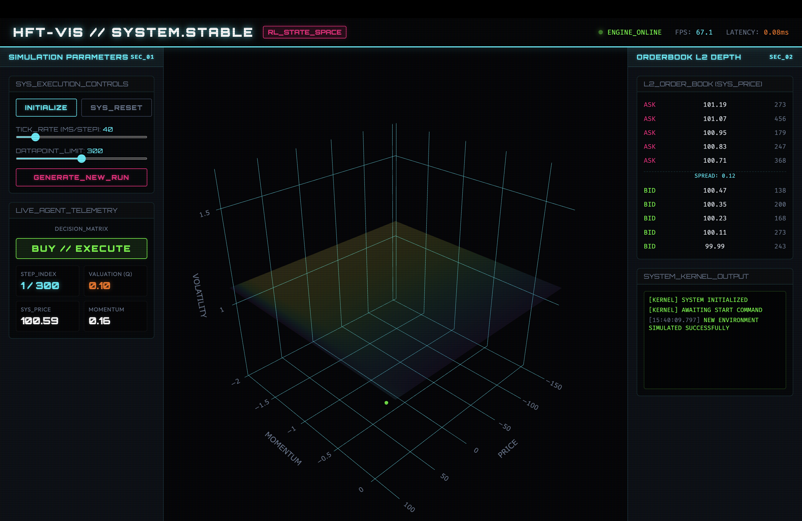

# 3D RL Trading Agent State Space & HFT Terminal Visualization

An interactive, high-fidelity visualization platform demonstrating how a reinforcement learning (RL) trading agent explores and makes decisions in a simulated financial state space. 

This repository includes both a **local Python 3D simulation script** and an **interactive Web-based HFT (High-Frequency Trading) Dashboard** with live metrics, order books, and kernel logs.



---

## ⚡ Core Features

### 1. Interactive Web HFT Terminal (`index.html`)
* **3D State Space Visualization**: Rotate, zoom, and explore the agent's Price, Momentum, and Volatility state transitions in 3D using Plotly.js.
* **Q-Value Surface Plane Overlay**: Visualize the agent's value function evolution at the average volatility level.
* **L2 Order Book Depth Widget**: Live-updating bids and asks stack synced to the active simulated market price ticks.
* **System Kernel Log Terminal**: Real-time scrolling shell printing internal state updates, timestamp logs, and agent decisions.
* **Playback Control Board**: Initialize, pause, step-by-step advance, reset, or change simulation parameters (tick rate and data limit) on the fly.

### 2. Python 3D Simulator (`rl_trading_3d_visualization.py`)
* Simulates state transition dynamics using a random walk model modified by momentum and volatility.
* Animates trajectories over time using Matplotlib's 3D axis backend (`FuncAnimation`).
* Colors state coordinates based on actions:
  * 🟢 **Buy**
  * 🔴 **Sell**
  * ⚪ **Hold**

---

## 🚀 How to Run

### Option A: Running the Web HFT Terminal (Recommended)
You can launch the dashboard using any simple local web server. For instance, using Python:

1. Open your terminal in the project directory.
2. Start the HTTP server:
   ```bash
   python3 -m http.server 8000
   ```
3. Open your browser and navigate to:
   ```
   http://localhost:8000
   ```

### Option B: Running the Python Simulator
To run the standard GUI-based Matplotlib visualization script:

1. Install the required dependencies:
   ```bash
   pip install matplotlib numpy
   ```
2. Run the script:
   ```bash
   python rl_trading_3d_visualization.py
   ```

---

## 📘 Relevant Concepts
* [Reinforcement Learning](https://en.wikipedia.org/wiki/Reinforcement_learning) - The framework where agents learn by interacting with environments.
* [Q-Learning](https://en.wikipedia.org/wiki/Q-learning) - The model-free reinforcement learning algorithm used to estimate the value of actions.
* [State Space](https://en.wikipedia.org/wiki/State_space_(controls)) - The multidimensional vector space representing all possible variables of the system (Price, Momentum, Volatility).
* [Order Book (L2 Depth)](https://en.wikipedia.org/wiki/Order_book) - The list of buy and sell orders for a specific financial instrument organized by price level.

---

## 📄 License
This project is licensed under the MIT License - see the [LICENSE](LICENSE) file for details.

Developed with 💻 by [Prince Maurya (alwaysprince05)](https://github.com/alwaysprince05).
